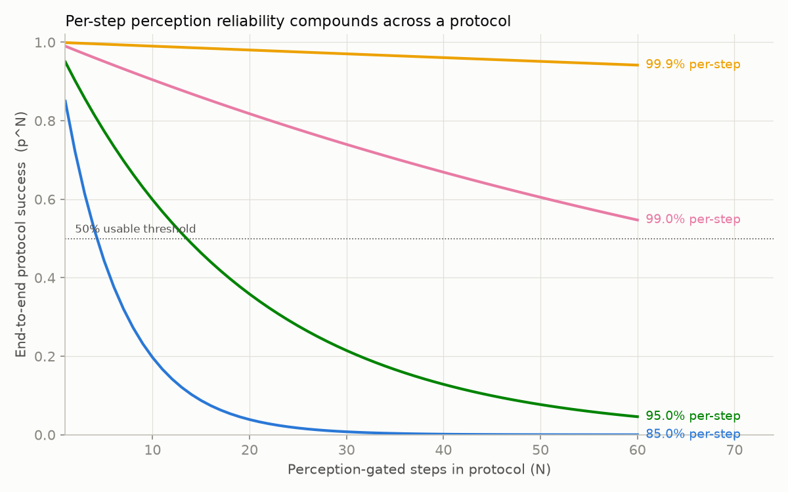
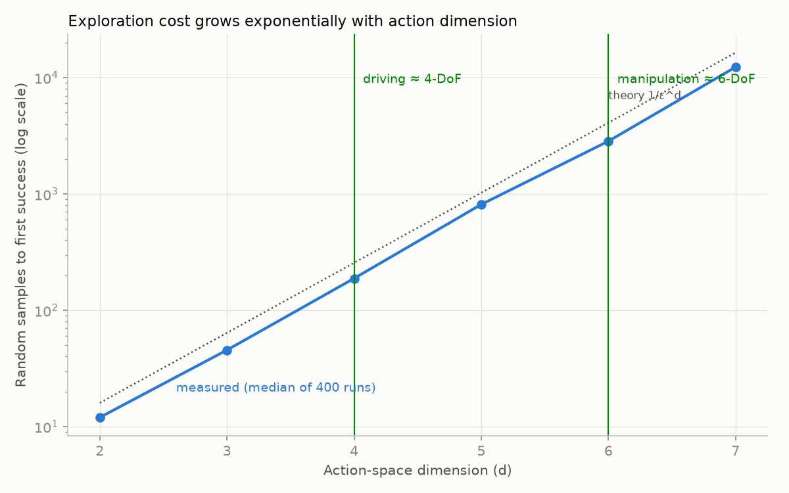
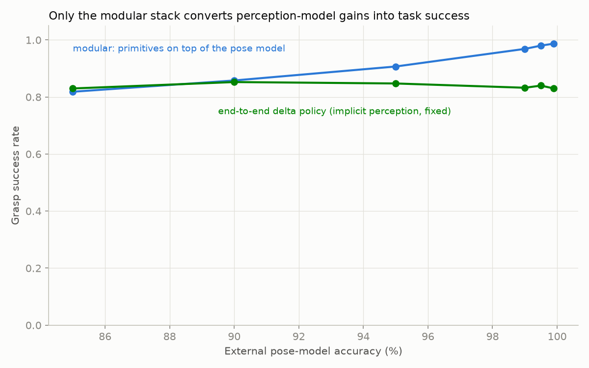
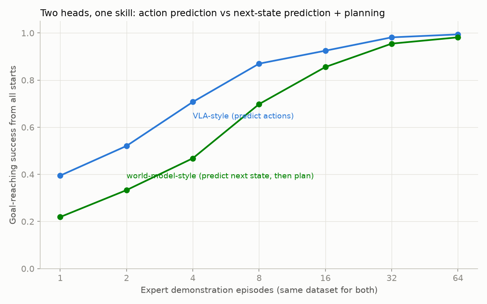

# model-experiments: robotics overhang, VLAs, and modular stacks

Toy experiments testing four claims from a conversation about the state of
robot manipulation — why recent perception-model progress is an "overhang,"
why manipulation is harder than driving, why parameterized action primitives
beat delta-action policies once perception is good, and why "VLAs vs world
models" is a false dichotomy.

These are deliberately minimal simulations (numpy + matplotlib, no robots, no
learned models) built to check whether the *logic* of each claim holds, not to
benchmark real systems.

## Setup

```bash
pip install numpy matplotlib
PYTHONPATH=experiments python3 experiments/run_all.py
```

Figures and a results log land in `results/`.

## Experiment 1 — The perception overhang (`exp1_perception_overhang.py`)

**Claim:** pose-estimation models recently jumped from ~85% to ~99% per-call
reliability, and that is worth far more than "+14%" because real protocols are
long sequences of perception-gated steps: end-to-end success is `p^N`.

**Result:** at a 50%-success bar, 85% per-step reliability supports a 4-step
protocol; 99% supports 68 steps — a **17x jump in feasible protocol length**
from a 14-point accuracy gain. At 99.9% it's 692 steps. The value of the last
few points of accuracy is wildly nonlinear — that nonlinearity is the overhang.



## Experiment 2 — Action-space dimensionality (`exp2_action_space_dimensionality.py`)

**Claim:** manipulation's action space is ~6-dimensional vs ~4 for driving,
and complexity "scales drastically" with dimension — one reason end-to-end
approaches that work for driving haven't transferred to manipulation.

**Result:** measured random-exploration cost matches the `1/ε^d` theory line:
going from 4-DoF to 6-DoF costs **16x more exploration per success** at
tolerance ε=0.25, and covering the space at 10 bins/dimension needs 100x more
cells (10^4 → 10^6). Every added action dimension is a multiplier, not an
increment.



## Experiment 3 — Delta actions vs parameterized primitives (`exp3_delta_actions_vs_primitives.py`)

**Claim:** framing actions as parameterized function calls — `move(pose)`,
`grab(pose)` — instead of predicting incremental deltas (a) lets the stack
leverage external perception models directly and (b) eliminates trajectory
shakiness.

**Result:** in a planar reach-and-grasp sim (2mm grasp tolerance), the modular
stack's success tracks the external pose model from 82% → 99% as the model
improves 85% → 99.9%. The end-to-end delta policy is stuck at ~84% — the
ceiling of its own implicit perception — no matter how good external models
get, and its trajectories jitter (~27°/tick heading change vs a straight
planned path).

**Honest caveat:** at 85–90% pose accuracy the two are comparable — closed-loop
servoing re-observes every tick and averages out weak perception. The
crossover is the finding: *once perception is near-perfect, one planned
primitive call wins*, and only the modular stack can consume perception
progress without retraining.



## Experiment 4 — "VLAs and world models are the same thing" (`exp4_vla_vs_world_model.py`)

**Claim:** the "VLAs are dead, world models are supreme" framing is a false
dichotomy — both are supervised learning on trajectories; they differ in the
prediction target (actions vs next states), not in what is learned.

**Result:** from the *same* expert demonstrations in a gridworld, an
action-prediction policy (VLA-style behavior cloning) and a next-state model +
planner (world-model-style) both converge to ~99% success as data grows. In
this toy, action prediction is actually *more* data-efficient (the expert's
choices directly supervise the policy; the planner has to reconstruct dynamics
first) — some evidence against "world models are supreme" as a blanket claim.



## What these toys do NOT show

- Real VLAs share representations across tasks and generalize from internet
  pretraining; none of that is modeled here.
- Experiment 3 hard-codes the assumption that an end-to-end policy can't
  consume external perception gains without retraining. That's the argument's
  premise made explicit, not an empirical discovery.
- Gridworlds say nothing about the sample complexity of learning *continuous*
  dynamics; Experiment 4 is about the shape of the dichotomy, not its scale.
