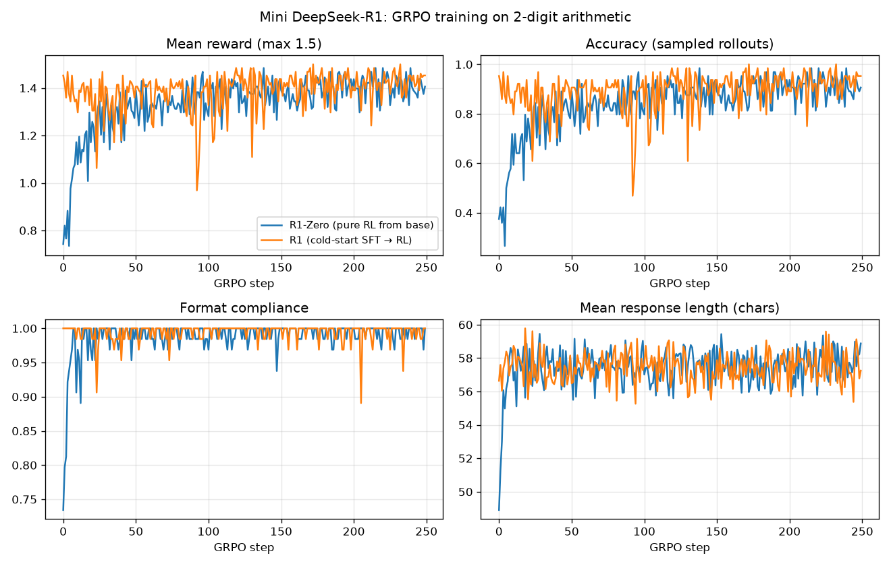

# Experiment 2 — DeepSeek-R1, implemented at miniature scale

Read the paper (*DeepSeek-R1: Incentivizing Reasoning Capability in LLMs via
Reinforcement Learning*, arXiv:2501.12948 — full notes in
[`PAPER_NOTES.md`](PAPER_NOTES.md)), then reproduce its **mechanism** end to
end on a CPU: pure reinforcement learning with rule-based rewards turning an
unreliable base model into a reliable reasoner.

## The mapping

| Paper | Here |
|---|---|
| DeepSeek-V3-Base (671B MoE) | 0.81M-param char-GPT (experiment 1's `model.py`) |
| Math / code / STEM problems | 2-digit arithmetic: `47+38=` |
| `<think>…</think><answer>…</answer>` template | identical |
| Rule-based accuracy + format rewards | identical (`tasks.py`) |
| **GRPO**: group-relative advantages, PPO clip, k3 KL to reference | identical math (`grpo.py`) |
| R1-Zero: pure RL from the base model | `train_r1_zero.py` |
| R1 stages 1–2: cold-start SFT → reasoning RL | `train_r1.py` |
| R1 stages 3–4, distillation | out of scope (need general data + reward model) |

## Files

- `tasks.py` — problem generator, pretraining corpus (with **deliberately
  corrupted reasoning** in ~25% of steps and missing think-tags in 15% of
  docs, so the base model is fluent but unreliable), and the two rule-based
  rewards from paper §2.2.2.
- `pretrain_base.py` — stage 0, the stand-in for V3-Base: next-token
  pretraining on the noisy corpus.
- `grpo.py` — GRPO from scratch: sample a group of G completions per prompt,
  advantage = (r − group mean)/group std, clipped importance-ratio surrogate,
  k3 KL penalty against a frozen reference policy. ~200 lines, generic over
  task and model.
- `train_r1_zero.py` — pure RL on the base model (no SFT). Logs curves and
  rollout transcripts.
- `train_r1.py` — cold-start SFT on 512 perfect CoT examples (loss masked to
  completion tokens), then the same RL with the SFT model as KL reference.
- `common.py`, `plot_curves.py`, `eval` via `common.evaluate` (greedy pass@1).

## Run it

```bash
python tasks.py             # reward self-tests
python pretrain_base.py     # ~10 min CPU -> base_model.pt
python train_r1_zero.py     # ~15 min CPU -> r1_zero.pt + curves
python train_r1.py          # ~15 min CPU -> r1.pt + curves
python plot_curves.py       # -> curves.png
```

## Results (this repo's actual run)



Greedy (pass@1-style) evaluation on 200 held-out problems:

| checkpoint | accuracy | format |
|---|---|---|
| base model (after noisy pretraining) | 91.0% | 95.0% |
| base, **sampled** at RL temperature | ~38–56% | ~73–85% |
| **R1-Zero** (base + 250 GRPO steps) | **100.0%** | **100.0%** |
| R1 cold-start SFT only (512 examples) | 100.0% | 100.0% |
| **R1** (SFT + 250 GRPO steps) | **100.0%** | **100.0%** |

During RL rollouts (temperature 0.9), R1-Zero's sampled accuracy climbed
**38% → ~92%**, format compliance **73% → 100%**, mean reward **0.74 → 1.44**
(max 1.5). The failure mode RL had to fix is visible in
`r1_zero_samples.txt` — early rollouts contain corrupted reasoning learned
from the noisy corpus:

```
[step 0]  95-64=<think>90-60=4,50+4=54</think><answer>54</answer>      (truth=31)
[step 10] 95-87=<think>90-80=1,5-7=-2,10-2=8</think><answer>8,41+8=11</answer>  (malformed)
...
[step 149] 83-39=<think>80-30=50,3-9=-6,50-6=44</think><answer>44</answer>  (correct)
```

The paper's observations, reproduced at ~1/800,000th the scale:

- **Pure RL works** (R1-Zero): no correct labels ever shown, only
  "was the sampled answer right" — and the policy converges to reliable,
  correctly-formatted reasoning.
- **Format locks in before accuracy** — the cheap 0.5 reward saturates by
  ~step 20, the 1.0 accuracy reward takes ~200 steps.
- **Cold start pays** (R1): SFT on 512 clean traces starts RL at reward 1.45
  vs R1-Zero's 0.74 — the pipeline's stage 1 exists precisely for this.
  (At this toy scale SFT alone already nails the task; in the paper the gap
  between cold-start and converged is where RL earns its keep.)
- One caveat we hit ourselves: our first RL run (lr 3e-4, temperature 1.0)
  *improved sampled accuracy but degraded greedy accuracy* 91% → 85% —
  over-hot updates blur the very mode you're trying to sharpen. Gentler
  updates (lr 1e-4, temp 0.9) fixed it. RLHF-style training is genuinely
  touchy about this; the KL leash alone doesn't save you.

## What to look for

1. **RL finds the latent capability.** The base model has seen mostly-correct
   arithmetic but is unreliable. GRPO never shows it a single correct label —
   only "was your sampled answer right" — and accuracy climbs anyway. That is
   R1-Zero's core claim at toy scale.
2. **Format locks in first, then accuracy.** The cheap 0.5 format reward is
   optimized quickly; the 1.0 accuracy reward takes longer — same ordering the
   paper describes.
3. **Cold start accelerates RL.** `train_r1.py` starts from a much higher
   reward and converges faster/stabler — the paper's stated reason for stage 1.
4. **The KL leash.** Set `kl_beta=0` in `GRPOConfig` and watch the policy
   drift into degenerate high-reward-variance outputs; the reference-policy
   KL is what keeps the language intact.
